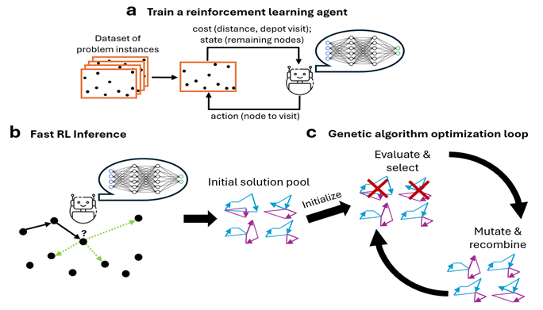
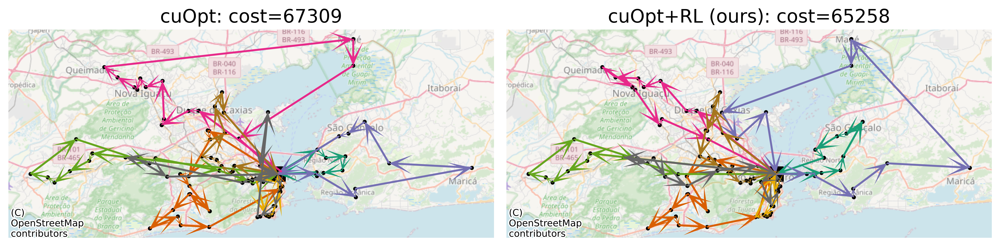

# EARLI: Evolutionary Algorithm with RL Initialization
*a cuOpt‑powered combinatorial optimization framework*

EARLI is a hybrid framework for solving the Vehicle Routing Problem (VRP). It uses Reinforcement Learning (RL) to learn to quickly generate high-quality solutions; then uses these as the initial population of a Genetic Algorithm (GA). The RL initialization enables leveraging of data for generalization across problems and acceleration of solving new instances. The GA search leverages inference time to refine the solution iteratively. Together, EARLI accelerates the time to find state-of-the-art solutions to VRP instances. More details are available in the paper [***Accelerating Vehicle Routing via AI-Initialized Genetic Algorithms***](https://arxiv.org/abs/2504.06126).

This repo integrates EARLI's framework with NVIDIA's cuOpt genetic algorithm solver.
The repo includes:
* **A parallelisable VRP environment** compatible with both gym and stable-baselines.
* **Training** code from a given data file of problem instances (see [training example notebook](ExampleTrain.ipynb)).
* **Inference** code that generates multiple solutions for a set of given problem instances.
* **Integration to NVIDIA's cuOpt**: the generated solutions are injected to the solver as its initial population (see [inference example notebook](Example.ipynb)).
* Several **pre-trained RL models** are provided, based on synthetic training data.

### Contents
* [Installation](#installation)
* [Examples](#examples)
   * [Training example notebook](ExampleTrain.ipynb)
   * [Inference example notebook](Example.ipynb)
* [Data](#data)
* [Alternative Training APIs](#alternative-training-apis)
* [Cite Us](#cite-us)

|  |
| :--: |
| ***EARLI***: a, During offline training, an RL agent interacts with a dataset of problems and learns to generate high-quality solutions. b, On inference, the trained RL agent faces a new problem instance and generates K solutions with quick decision making. c, The K solutions are used as the initial population of the cuOpt genetic algorithm, initiating its optimization loop. |


|  |
| :--: |
| The solution of cuOpt, with and without EARLI, in a sample problem of 100 customers in Rio de Janeiro, given a time-budget of 1s. The RL agent was trained on Sao-Paulo problems and generalized to Rio. Note that the arrows are straight for visualization only: the actual traveling costs correspond to road-based driving time. |


# Installation

## Option I: pip install

1. Clone this repo:
```bash
git clone https://github.com/NVlabs/EARLI.git
cd EARLI
```
2. (Recommended) Create and activate a new virtual environment with Python>=3.10:
```bash
python3.11 -m venv earli_venv
source earli_venv/bin/activate
pip install --upgrade pip
```
3. Install build tools (for compiling C/C++ extensions):
```bash
sudo apt-get update -y && sudo apt-get install -y git build-essential ninja-build
```
4. Install EARLI and its dependencies:
```bash
pip install --upgrade --extra-index-url https://pypi.nvidia.com -c constraints.txt .
```


## Option II: Download our prebuilt Docker

1. Install Docker and NVIDIA Container Toolkit. 
   Follow the instructions in the [NVIDIA Container Toolkit](https://docs.nvidia.com/datacenter/cloud-native/container-toolkit/latest/install-guide.html).
2. Download the docker image.
```bash
docker pull ido90/earli:1.00
```
3. Run the docker container with:
```bash
docker run -it --rm --runtime=nvidia --network=host --gpus all -v <SOURCE_DIR_PATH>:/opt/source ido90/earli:1.00 /bin/bash
```
where `<SOURCE_DIR_PATH>` is the path to the folder containing the EARLI source code and data files on your host machine.

4. Inside the docker:
```bash
cd /opt/source
```


## Option III: Build the Docker yourself

Same steps as Option II, but instead of step 2, clone the repo and run:
```bash
docker build --network=host -t earli:latest -f Dockerfile .
```


# Examples

Example for training is provided in [`ExampleTrain.ipynb`](ExampleTrain.ipynb).

Example for inference is provided in [`Example.ipynb`](Example.ipynb). It can be used with our pretrained RL agents provided under `earli/pretrained_models/`, or with a new trained agent.

If you use a docker and not a virtual environment (options II-III above), you may still run the Jupyter Notebooks within the docker, by running the command below and copying the printed URL into the browser:
```
docker run --rm -it \
  -p 127.0.0.1:8888:8888 \
  -v "$PWD":/work -w /work --gpus all \
  ido90/earli:1.00 \
  bash -lc '
    git config --global --add safe.directory /work || true
    PY=/opt/conda/bin/python3
    $PY -V
    $PY -m pip install -q jupyterlab ipykernel
    $PY -m jupyter lab --ip=0.0.0.0 --no-browser --port=8888 --allow-root
  '
```


# Data

The data of problem instances - for either training or inference - should be stored in a `pickle` file that contains a python dictionary with the following fields:
* `'positions'`: `numpy.ndarray, (n_problems, problem_size, 2)`
* `'distance_matrix'`: `numpy.ndarray, (n_problems, problem_size, problem_size)`
* `'demands'`: `numpy.ndarray, (n_problems, problem_size)`
* `'capacities'`: `numpy.ndarray, (n_problems,)`

Sample problems can be downloaded from the [NVIDIA Labs olist-vrp-benchmark repository](https://github.com/NVlabs/olist-vrp-benchmark):

```bash
python download_data.py --cleanup
```

This downloads into `./datasets/` VRP problems based on real Brazilian e-commerce data with various sizes (50-500 nodes) for Rio de Janeiro and São Paulo.


# Alternative Training APIs

The training example in the notebook uses Stable-Baselines VecEnv API, enabling both an efficient vectoric environment and the standard SB3 algorithms. To use this API, in `config.yaml`, `compatibility_mode` should be set to `stable_baselines`. We support two additional APIs:
1. `gym`: The standard non-vectoric Gym API (>0.27).
2. `null`: The API used in our [paper](https://arxiv.org/abs/2504.06126), enabling both our custom PPO implementation and K-beam solution generation. This mode is necessary for generating $K>1$ solutions on inference.

By default, we recommend mode `stable_baselines` for training and `null` for inference.


### stable_baselines API

* `step` returns a tuple of `(state, reward, done, info)`, where:
   - `state` is a dictionary of numpy arrays, each of dimensions `(n_problems, ...)`.
   - `reward` is a numpy array of length `n_problems`, containing the rewards for each problem.
   - `done` is a numpy array of length `n_problems`, indicating whether each problem is done.
   - `info` is a dictionary containing additional information about the environment.
* `reset` returns a state.

### gym API

* `step` returns a tuple of `(state, reward, done, truncated, info)`, where:
   - `state` is a dictionary of numpy arrays, each of dimensions `(n_problems, n_beams, ...)`.
   - `reward` is a numpy array of length `(n_problems, n_beams)`, containing the rewards for each problem.
   - `done` is a numpy array of length `(n_problems, n_beams)`, indicating whether each problem is done.
   - `truncated` is a numpy array False of length `n_problems`, for compatibility with the latest Gym API.
   - `info` is a dictionary containing additional information about the environment.
* `reset` returns a tuple (`state, {}`).

### null API
* `step` returns a tuple of `(state, reward, done,info)`, where:
   - `state` is a TensorDict, each tensor is of of dimensions `(n_problems, n_beams, ...)`.
   - `reward` is a torch array of length `(n_problems, n_beams)`, containing the rewards for each problem and beam.
   - `done` is a numpy array of length `(n_problems, n_beams)`, indicating whether each problem and beam is done.
   - `info` is a dictionary containing additional information about the environment.
* `reset` returns a `state`.


# Cite Us

This repo is published by NVIDIA as part of the paper ***Accelerating Vehicle Routing via AI-Initialized Genetic Algorithms***.
To cite:

```
@article{EARLI25,
  title={Accelerating Vehicle Routing via AI-Initialized Genetic Algorithms},
  author={Greenberg, Ido and Sielski, Piotr and Linsenmaier, Hugo and Gandham, Rajesh and Mannor, Shie and Fender, Alex and Chechik, Gal and Meirom, Eli},
  journal={arXiv preprint},
  year={2025}
}
```
